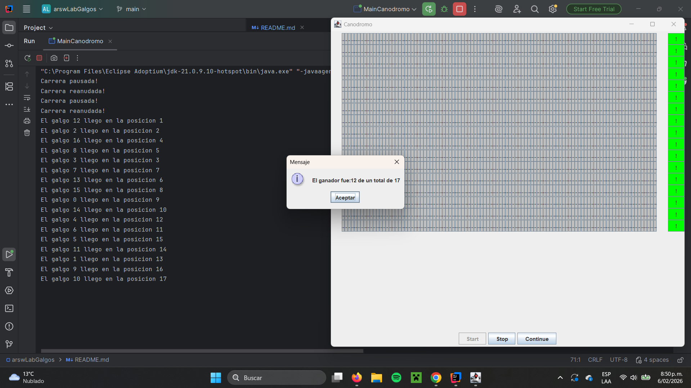

# 🐕 Laboratorio 2 – Programación Concurrente: Carrera de Galgos

Sebastián Barros
Julián Ramírez
Lina Sánchez

## Arquitectura de Software (ARSW)

### Objetivo
El objetivo de este laboratorio es que el estudiante **analice, corrija y diseñe una solución concurrente**, identificando **problemas de sincronización**, **regiones críticas** y aplicando **mecanismos adecuados de control de concurrencia** en Java.

El ejercicio se basa en una simulación de una **carrera de galgos**, donde cada galgo se ejecuta como un hilo independiente y avanza por un carril hasta completar la pista.

---

## Contexto del problema
En la simulación:

- Cada **galgo** corre de manera concurrente (un hilo por galgo).
- Todos los galgos comparten un **registro de llegada**.
- El sistema permite **iniciar**, **detener** y **reanudar** la carrera.
- Al finalizar la carrera, se debe mostrar el **orden de llegada (ranking)** de forma consistente.

La aplicación presenta inicialmente **problemas de sincronización** que deben ser analizados y corregidos.

---

## Estructura general del proyecto

El proyecto sigue una **separación por capas**, consistente con el laboratorio anterior:

```
src
 ├── main
 │   └── java
 │       └── edu.eci.arsw.dogsrace
 │           ├── app        -> Punto de entrada y orquestación
 │           ├── threads    -> Hilos de ejecución (galgos)
 │           ├── control    -> Control de la ejecución concurrente
 │           ├── domain     -> Modelo y estado compartido
 │           └── ui         -> Interfaz gráfica
 └── test
     └── java
         └── edu.eci.arsw.dogsrace
```

---

## Actividades a desarrollar

### 1️⃣ Sincronización de finalización de hilos

Análisis:

---

### 2️⃣ Identificación de inconsistencias y regiones críticas

Análisis:

---

### 3️⃣ Funcionalidades de pausa y continuación

Evidencia:

Stop:


Continue:


Resultados:



Análisis:

En este punto, se implementa la funcionalidad de parar y continuar la carrera, asegurando que todos los hilos se comporten de forma coordinada. Para lograrlo, se utiliza un monitor común junto con los métodos wait() y notifyAll(), siguiendo las restricciones establecidas.


El reto principal es que:

- Existen muchos hilos ejecutándose en paralelo

- Todos deben detenerse cuando se presiona Stop

- Todos deben reanudar exactamente cuando se presiona Continue

- Ningún hilo debe seguir avanzando mientras la carrera esté detenida

- Ningún hilo debe quedarse bloqueado al reanudar

- Esto no puede resolverse correctamente usando solo variables booleanas o sleep(), ya que eso provocaría:

- Consumo innecesario de CPU

- Estados inconsistentes

- Hilos avanzando cuando no deberían

Por eso se introduce el monitor común.


Monitor común: Este es un objeto compartido por todos los hilos de los galgos y por el controlador de la carrera (botones Stop y Continue).

Esto nos permite que se cumplan tres funciones fundamentales:

1. Exclusión mutua

Se consigue gracias al uso de synchronized (monitor) y garantiza que:

- Solo un hilo a la vez puede acceder a la sección crítica

- No existen condiciones de carrera al leer o modificar el estado de la carrera

- El valor que indica si la carrera está pausada o no es siempre consistente

2. Sincronización de estado

Permite que los hilos sincronicen su ejecución según una condición: “La carrera está pausada?” Cada hilo verifica, dentro de un ciclo while, esta condicion para determinar si sigue ejecutandose.

3. Coordinación de espera y notificación

Todos los accesos a la condición de pausa/reanudación se realizan dentro de bloques synchronized sobre este mismo objeto.

Stop:

Cuando se presiona el botón Stop, primero, se entra a una sección sincronizada sobre el monitor, luego se cambia el estado de la variable booleana paused, así los galgos saben si deben parar o no. Cuando un galgo entra al monitor y ve que la carrera está detenida: llama a wait(), libera el monitor  y queda bloqueado hasta que vuelva a cambiar. De esta forma todos los galgos queden suspendidos, independientemente del punto exacto de la pista en el que se encuentren.


Continue:
Por otro lado, cuando se presiona el botón Continue, se entra nuevamente a una sección sincronizada sobre el monitor, se actualiza el estado de la carrera para indicar que ya no está pausada, se ejecuta notifyAll() sobre el monitor

notifyAll() es fundamental porque:

-Hay múltiples hilos esperando

-Todos deben despertarse

-Usar notify() podría dejar algunos galgos bloqueados indefinidamente

Al despertarse, cada galgo, recupera el monitor, vuelve a evaluar la condición de pausa, continúa su ejecución normal si la carrera ya está activa

Ventajas del enfoque:

1. Sincronización segura y sin condiciones de carrera

El uso de bloques synchronized sobre un único monitor garantiza que:

- Solo un hilo puede evaluar o modificar el estado de la carrera a la vez

- Todos los hilos observan un estado coherente del sistema

Esto evita errores clásicos de concurrencia como:

Algunos hhilos avanzando mientras la carrera debería estar detenida o cambios de estado que no son visibles para otros hilos

2. Espera eficiente sin consumo innecesario de CPU

Cuando un galgo detecta que la carrera está pausada, entra en estado de espera gracias a wait().
Esto significa que:

- El hilo se bloquea completamente

- No consume tiempo de CPU mientras está detenido

3. Coordinación centralizada entre todos los hilos

El monitor común actúa como un punto central de coordinación, lo que permite que:

- Una sola acción (Stop o Continue) afecte a todos los galgos

- No sea necesario controlar cada hilo de manera individual

- El comportamiento global de la carrera sea consistente

Esto simplifica considerablemente el diseño, ya que:

No se requiere lógica adicional por cada galgo

No existen dependencias complejas entre hilos

El flujo de control es claro y fácil de seguir

4. Reanudación correcta y completa con notifyAll()

El uso de notifyAll() asegura que:

- Todos los galgos que estaban esperando son despertados

- Ningún hilo queda bloqueado accidentalmente

- La carrera se reanuda de forma completa y simultánea

Esto es clave en escenarios con múltiples hilos, ya que usar, por ejemplo, notify(): Podría despertar solo a un galgo, dejar a otros bloqueados indefinidamente, provocar un estado inconsistente en la carrera

5. Control cooperativo de los hilos 

Los hilos no son detenidos de manera abrupta. Cada galgo coopera revisando constantemente el estado del monitor y decidiendo si debe continuar o esperar.

Esto evita el uso de métodos peligrosos como stop() o suspend(), estados corruptos, interrupciones inesperadas o inecesarias.

6. Escalabilidad y extensibilidad del diseño

Este enfoque permite que el sistema escale fácilmente, ya que se pueden añadir más galgos sin modificar la lógica de control , el monitor sigue funcionando independientemente del número de hilos, el comportamiento se mantiene estable incluso con mayor concurrencia

Además, el mismo patrón podría reutilizarse para, Implementar otras condiciones de espera o acciones similares al Stop y Continue como un botón de reiniciar, o sincronizar otros componentes del sistema

---
