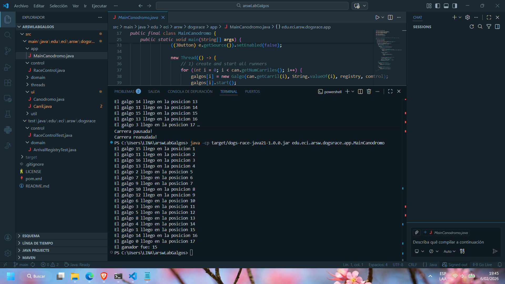
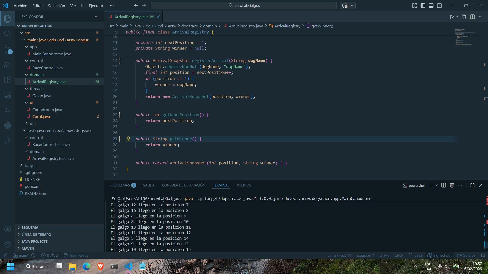
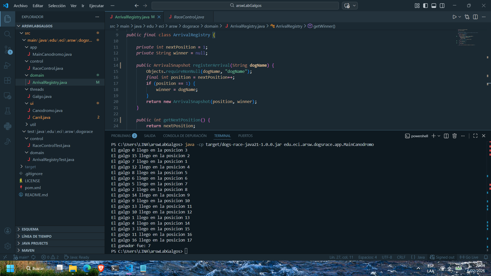

# 🐕 Laboratorio 2 – Programación Concurrente: Carrera de Galgos

## Arquitectura de Software (ARSW)

### Objetivo
El objetivo de este laboratorio es que el estudiante **analice, corrija y diseñe una solución concurrente**, identificando **problemas de sincronización**, **regiones críticas** y aplicando **mecanismos adecuados de control de concurrencia** en Java.

El ejercicio se basa en una simulación de una **carrera de galgos**, donde cada galgo se ejecuta como un hilo independiente y avanza por un carril hasta completar la pista.

---

## Contexto del problema
En la simulación:

- Cada **galgo** corre de manera concurrente (un hilo por galgo).
- Todos los galgos comparten un **registro de llegada**.
- El sistema permite **iniciar**, **detener** y **reanudar** la carrera.
- Al finalizar la carrera, se debe mostrar el **orden de llegada (ranking)** de forma consistente.

La aplicación presenta inicialmente **problemas de sincronización** que deben ser analizados y corregidos.

---

## Estructura general del proyecto

El proyecto sigue una **separación por capas**, consistente con el laboratorio anterior:

```
src
 ├── main
 │   └── java
 │       └── edu.eci.arsw.dogsrace
 │           ├── app        -> Punto de entrada y orquestación
 │           ├── threads    -> Hilos de ejecución (galgos)
 │           ├── control    -> Control de la ejecución concurrente
 │           ├── domain     -> Modelo y estado compartido
 │           └── ui         -> Interfaz gráfica
 └── test
     └── java
         └── edu.eci.arsw.dogsrace
```

---

## Actividades a desarrollar

### 1️⃣ Sincronización de finalización de hilos

Análisis:

---

### 2️⃣ Identificación de inconsistencias y regiones críticas

Análisis:

En la ejecución de la aplicación se identificó que la región crítica corresponde al método registerArrival de la clase ArrivalRegistry. Este método actualiza dos variables compartidas por todos los hilos: nextPosition y winner. Al ser accedidas concurrentemente por múltiples galgos, sin sincronización se producen condiciones de carrera.

Las inconsistencias se observan porque varios hilos pueden leer y modificar nextPosition al mismo tiempo. Esto ocasiona que dos galgos reciban la misma posición o que el ganador se asigne de manera incorrecta. En las ejecuciones sin sincronización se evidencian resultados donde el orden de llegada no coincide con el ranking mostrado, o el ganador aparece listado después de otros corredores, lo cual refleja la falta de exclusión mutua.

La solución consiste en sincronizar únicamente esa región crítica. Al declarar el método registerArrival como synchronized, se garantiza que solo un hilo a la vez pueda modificar nextPosition y winner. De esta forma, el ranking se mantiene consistente en todas las ejecuciones y el ganador siempre corresponde al primer galgo que llega. Las capturas de pantalla muestran claramente la diferencia: sin sincronización aparecen posiciones desordenadas, mientras que con sincronización el ranking es correcto y estable.







---

### 3️⃣ Funcionalidades de pausa y continuación

Análisis:

---
